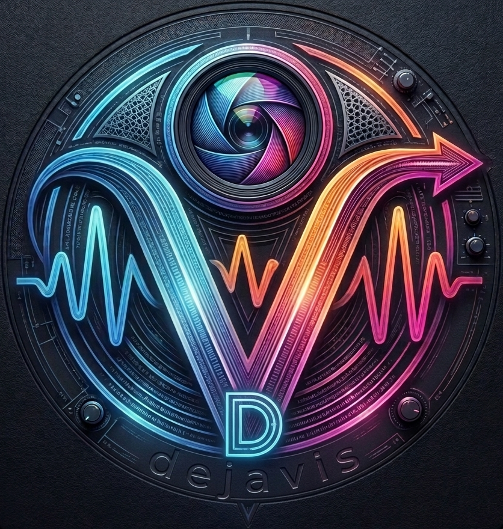

## dejavis-ui

dejavis-ui is a trivial Audio/Video mixer with VIS  
I started this as a "swiss army knife" for audio/video form "any" source to "any" dest.  
I also integrated the terrific projectM library to add fancy vis if needed  

dejavis-ui is diveded in two parts backend and frontend.

backend is main app that run on machine and uses the gpu/cpu to do fancy stuff with your media

frontend is the webpages (react/TS) that connect via websocket and control the backend.

Since backend is controlled via websocket, anyone can write his own controller for backend in any language.

Features:

- Audio Mixer (16x2) Input can be live,url,file
- Video Mixer (Vulkan based) with integrated Post-Processing (ChromaKey,LumaKey) on RGB space (for now)
- High-performance YUV to RGB conversion (NV12, P010, UYVY, YUV420P)
- Support for static image sources
- projectM vis (openGL -> Vulkan zero-copy)
- projectm presets persistence via SQLite
- vulkan video decode and encode (if supported by hw/drivers (MacOS uses videotoolbox))
- SRT output
- SPOUT2 support (windows only)
- Web Interface for setting/controlling
- Win/Linux/Mac support
- NDI Support (both send and receive)
- WebRTC Video/Audio or only Audio (to remote monitor the output)

Since this is a "complex" software involving many process/protocols/codecs it uses many great library under the hood

Library used:

- Drogon (for HTTPS/WebSocket) https://github.com/drogonframework/drogon
- ffmpeg (Audio/Video Codec, Formats, Streaming,DSP) https://ffmpeg.org/
- projectM (Visualizer) https://projectm.io
- portaudio (Audio I/O multiplatform) https://portaudio.com/
- libdatachannel (WebRTC) https://github.com/paullouisageneau/libdatachannel
- SQLiteC++ https://github.com/srombauts/sqlitecpp
- shaderc https://github.com/google/shaderc
- SPIR-V Tools https://github.com/khronosGroup/SPIRV-Tools
- SPOUT2 (Windows only) https://github.com/leadedge/Spout2
- NDI SDK https://ndi.video/for-developers/ndi-sdk/

Thanks to: 

- a very special tanks goes to Kai Blaschke https://github.com/kblaschke who gave me invaluable advice during the development of dejavis-ui

## License
dejavis-ui is released under the BSD 3-Clause License.
See the [LICENSE](LICENSE) file for more details.