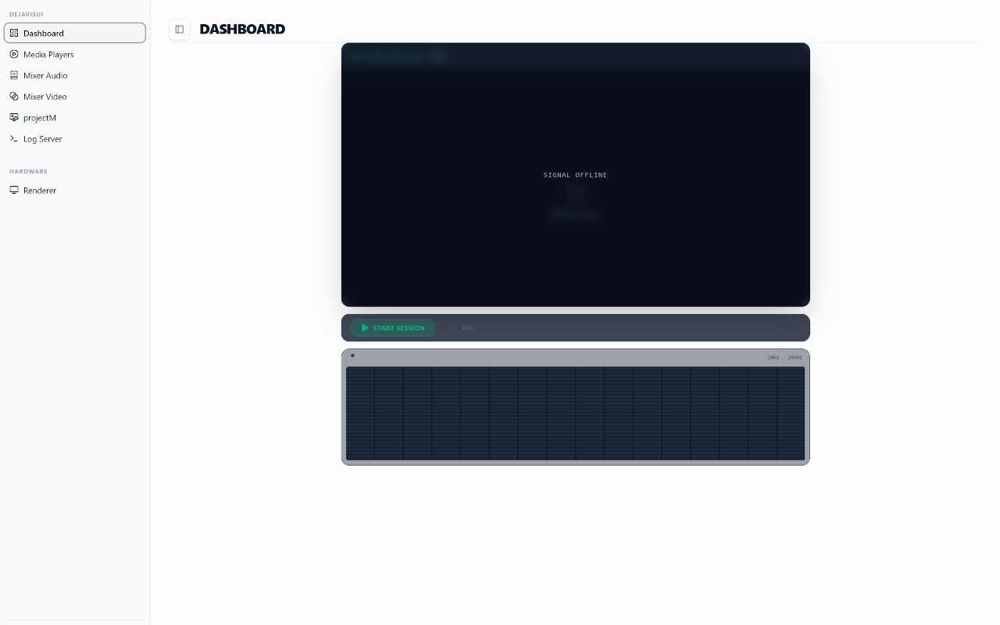
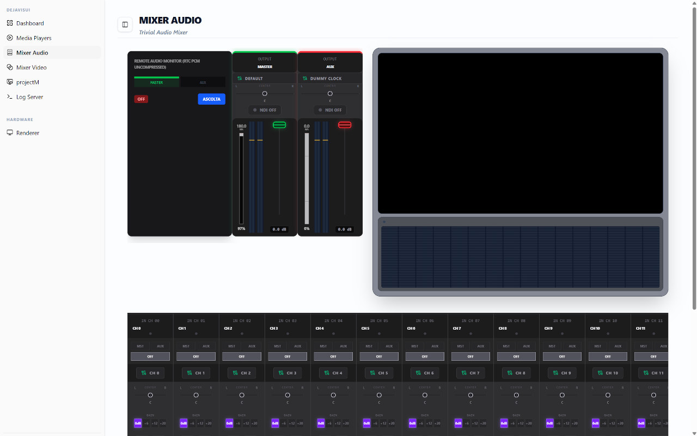
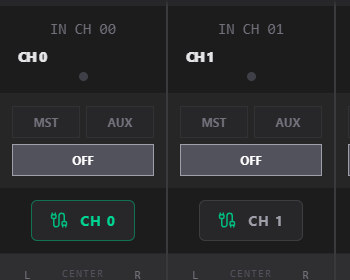
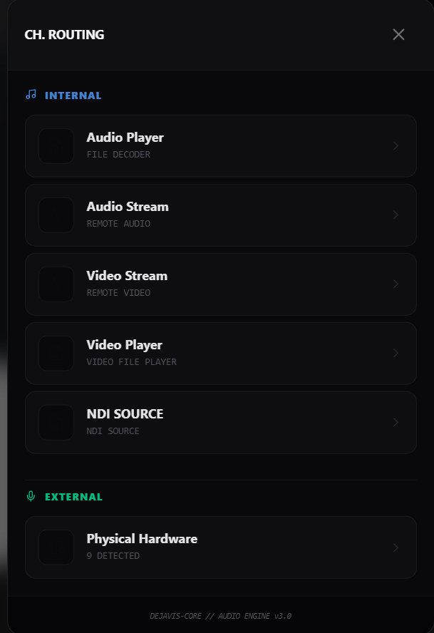
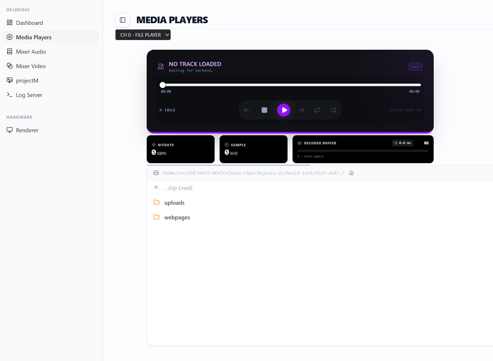

### A small usage guide (WIP)

This is the starting dashboard. if backend is started with srt output enabled you can use start session to see webrtc

All starts from Audio Mixer

to add a source 

Click on CH to open the source selection

Once added if is a player source you have to use 

This is the player for the path you used in backend config